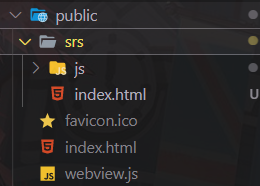

# vue 用 iframe 加载本地 html

### 使用方法

```vue
<template>
  <div>
    <iframe class="rtc_box" :src="livePusherUrl" scrolling="no" frameborder="0" style="width: 100%; height: 100%"></iframe>
  </div>
</template>

<script>
export default {
  name: 'LivePush',
  data() {
    return {
      pullUrl: 'webrtc://192.168.100.160/live/43a17d97-0ca2-4ecc-b43b-608f481d75f2',
      livePusherUrl: ''
    }
  },
  mounted() {
    let that = this
    // srs 放在 public 目录下 ，和 index.html 平级
    that.livePusherUrl = `/srs/index.html?webrtcSrc=${encodeURIComponent(that.pushUrl)}`
  }
}
</script>
```


